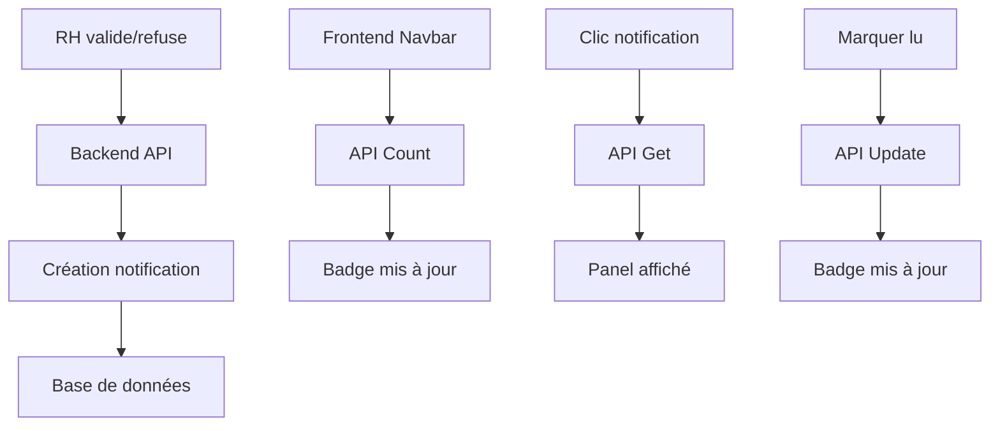

# 🔔 Système de Notifications - Documentation Complète

## 📋 Vue d'ensemble

Le système de notifications permet aux utilisateurs de recevoir automatiquement des notifications quand les RH valident ou refusent leurs demandes de congé.

## 🏗️ Architecture

### 1. Backend (FastAPI)

#### **Modèle de données**
- `app/models/notification.py` : Modèle SQLAlchemy pour les notifications
- `app/models/user.py` : Relation ajoutée avec les notifications

#### **Services**
- `app/services/notification_service.py` : Service de gestion des notifications
  - Création de notifications
  - Récupération des notifications
  - Marquage comme lu
  - Comptage des notifications non lues

#### **Endpoints API**
- `GET /notifications/{matricule}` : Récupérer les notifications d'un utilisateur
- `GET /notifications/{matricule}/count` : Compter les notifications non lues
- `POST /notifications/{matricule}/{notification_id}/read` : Marquer une notification comme lue
- `POST /notifications/{matricule}/read-all` : Marquer toutes comme lues

#### **Intégration RH**
- `app/routes/demande_conge_admin.py` : Création automatique de notifications lors de validation/refus

### 2. Frontend (Next.js)

#### **APIs**
- `pages/api/notifications.js` : Proxy vers le backend pour les notifications
- `pages/api/notifications-count.js` : Proxy pour le compteur

#### **Interface utilisateur**
- `components/Navbar.js` : Icône de notification avec badge et panel déroulant
- Actualisation automatique toutes les 30 secondes
- Interface responsive et moderne

## 🚀 Fonctionnalités

### 1. **Notifications automatiques**
- ✅ Demande validée : Notification verte avec détails
- ❌ Demande refusée : Notification rouge avec informations
- 📝 Mise à jour de statut : Notification informative

### 2. **Interface utilisateur**
- 🔔 Icône cliquable dans la navbar
- 🔴 Badge rouge avec compteur (ex: 3, 9+)
- 📋 Panel déroulant avec liste des notifications
- 👁️ Distinction visuelle entre lues/non lues
- ⚡ Actualisation en temps réel

### 3. **Gestion**
- 📖 Marquer une notification comme lue
- 📚 Marquer toutes comme lues
- 🕒 Horodatage des notifications
- 🔗 Lien vers la demande concernée (optionnel)

## 📊 Types de notifications

| Type | Icône | Description |
|------|-------|-------------|
| `conge_valide` | ✅ | Demande de congé validée |
| `conge_refuse` | ❌ | Demande de congé refusée |
| `conge_update` | 📝 | Mise à jour de statut |
| `info` | ℹ️ | Information générale |

## 🔄 Flux de données



## 🎯 Utilisation

### Pour un utilisateur :
1. **Connexion** : Se connecter avec son matricule
2. **Notification** : Badge rouge apparaît si nouvelles notifications
3. **Consultation** : Cliquer sur l'icône pour voir les détails
4. **Lecture** : Marquer comme lu individuellement ou en groupe

### Pour les RH :
1. **Validation/Refus** : Utiliser l'interface admin
2. **Notification automatique** : Le système crée automatiquement la notification
3. **Suivi** : L'utilisateur est notifié instantanément

## 🛠️ Installation et Configuration

### 1. Backend
```bash
# Les modèles et services sont déjà en place
# Assurer que les imports sont corrects dans main.py
```

### 2. Frontend
```bash
# Les composants sont déjà intégrés
# L'icône notif.png doit être dans public/
```

### 3. Base de données
```sql
-- Table notifications sera créée automatiquement
-- Relation avec users via foreign key
```

## 📱 Interface Mobile

Le système est responsive et fonctionne sur :
- 📱 Smartphones
- 📄 Tablettes  
- 💻 Desktop

## 🔐 Sécurité

- ✅ Authentification par matricule
- ✅ Vérification des permissions
- ✅ Isolation des données utilisateur
- ✅ Validation des entrées

## 🚀 Améliorer le système

### Fonctionnalités futures possibles :
- 📧 Notifications par email
- 📱 Push notifications navigateur
- 🔔 Sons de notification
- 📈 Statistiques des notifications
- 🎨 Personnalisation des types
- 📅 Notifications programmées

## 🐛 Debugging

### Vérifications :
1. **Backend** : Vérifier les logs de création de notifications
2. **API** : Tester les endpoints directement
3. **Frontend** : Vérifier la console pour erreurs
4. **Base de données** : Vérifier que les notifications sont créées

### Commandes utiles :
```bash
# Test du système
python backend/test_notifications.py

# Vérifier les notifications en DB
# SELECT * FROM notifications WHERE user_id = X;
```

## ✅ Conclusion

Le système de notifications est maintenant complètement fonctionnel et intégré. Les utilisateurs recevront automatiquement des notifications lors de validation/refus de leurs demandes de congé par les RH, avec une interface moderne et intuitive dans la navbar.
